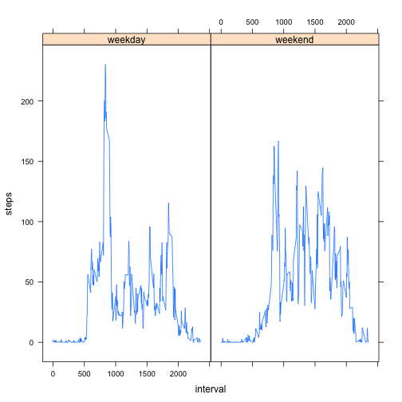

This is Peer Assessment 1 in course Reproducible Research.

1. Loading and preprocessing the data

Load data and order by date

```r
data <- read.csv("activity.csv")
data <- data[order(data$date),]
```


2. Total number of steps taken per day


```r
split_data <- split(data, data$date)
steps_day <- sapply(split_data, function(a) sum(a[,1],na.rm=TRUE))
hist(steps_day, breaks = 61, col = "blue", xlab = "steps", main = "steps taken per day")
```

 

```r
mean_step <- mean(steps_day)
med_step <- median(steps_day)
```

Mean of the total number of steps taken per day

```r
mean_step
```

```
## [1] 9354.23
```
Median of the total number of steps taken per day

```r
med_step
```

```
## [1] 10395
```


3. Average daily activity


```r
split_data <- split(data, data$interval)
steps_int <- sapply(split_data, function(a) sum(a[,1],na.rm=TRUE))
plot(steps_int, type="l", col="blue",xlab = "interval",ylab = "steps", main = "Average daily activity")
```

 


4. Imputing missing values

Total number of missing values in the dataset

```r
sum(is.na(data))
```

```
## [1] 2304
```

I use the mean for that 5-minute interval to imputing missing values 

```r
#mean for that 5-minute interval
mean_steps_int <- sapply(split_data, function(a) round(mean(a[,1],na.rm=TRUE)))

#new dataset without missing values
cleardata <- data
for(i in 1:length(cleardata$steps)){
  if(is.na(cleardata$steps[i])){
    cleardata$steps[i] <- mean_steps_int[as.character(cleardata$interval[i])]
  }
}
```

Histogram of the total number of steps taken each day without missing values

```r
split_cleardata <- split(cleardata, cleardata$date)
steps_clearday <- sapply(split_cleardata, function(a) sum(a[,1],na.rm=TRUE))
hist(steps_clearday, breaks = 61, col = "blue", xlab = "steps", main = "steps taken each day without missing values")
```

 

```r
mean_clearstep <- mean(steps_clearday)
med_clearstep <- median(steps_clearday)
```

Mean of the total number of steps taken per day

```r
mean_clearstep
```

```
## [1] 10765.64
```

Median of the total number of steps taken per day

```r
med_clearstep
```

```
## [1] 10762
```

The mean and median differ from the estimates from the first part.
The mean and median increased. The number of days with 0 steps decreased. 
In the first part difference between mean and median was around 1000.
After imputing missing values there is no difference between mean and median.


5. Differences in activity patterns between weekdays and weekends

New variable with two levels – “weekday” and “weekend”

```r
cleardata$weekday <- weekdays(as.Date(cleardata$date))
cleardata$weekday[cleardata$weekday=="суббота" | cleardata$weekday=="воскресенье"]<-"weekend"
cleardata$weekday[cleardata$weekday!="weekend"]<-"weekday"
cleardata$weekday <- as.factor(cleardata$weekday)
```

Average for weekday and weekend

```r
wday <- subset(cleardata, weekday == "weekday")
split_wday <- split(wday, wday$interval)
wday_int <- sapply(split_wday, function(a) mean(a[,1],na.rm=TRUE))

wend <- subset(cleardata, weekday == "weekend")
split_wend <- split(wend, wend$interval)
wend_int <- sapply(split_wend, function(a) mean(a[,1],na.rm=TRUE))
```

Create one dataset with average for weekday and weekend and plot with library lattice

```r
int <- unique(cleardata$interval)
data1 <- rbind(data.frame(wday_int, int, rep("weekday",length(wday_int))))
data2 <- rbind(data.frame(wend_int, int, rep("weekend",length(wend_int))))
names(data1)<-c("steps","interval", "weekday")
names(data2)<-c("steps","interval", "weekday")
newdata <- rbind(data1, data2)

library(lattice)
xyplot(steps~interval|weekday,newdata, type="l")
```

 
